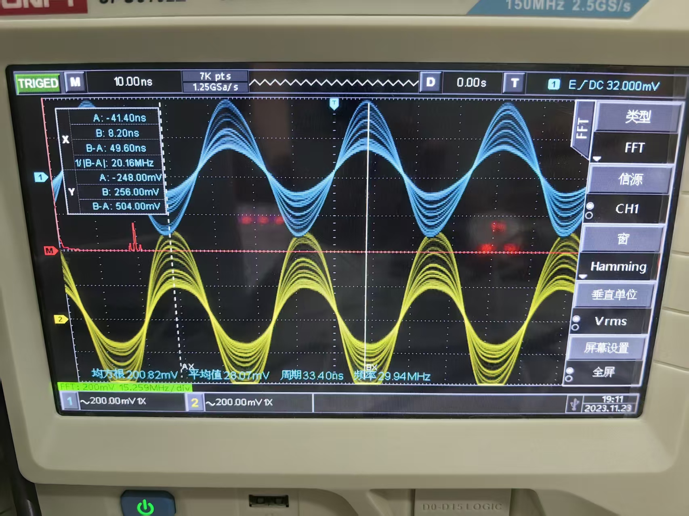
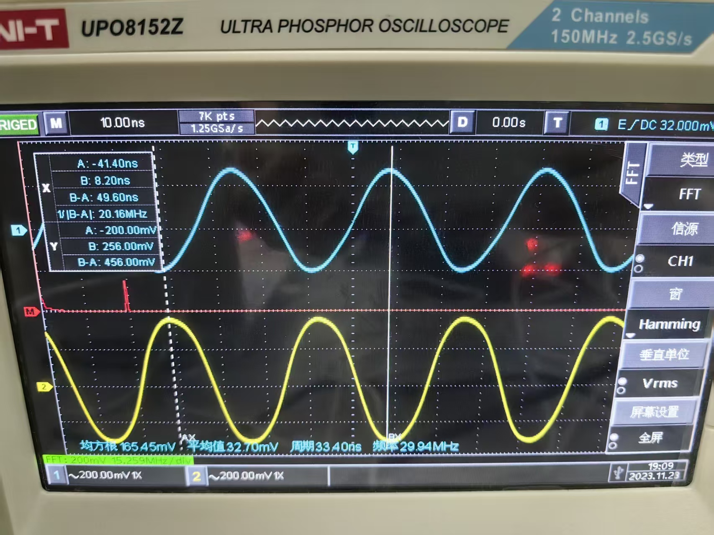
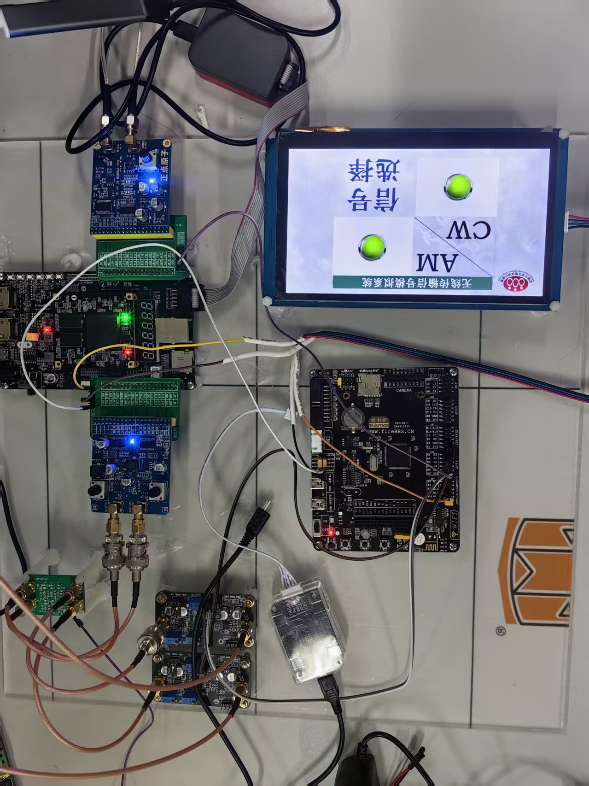
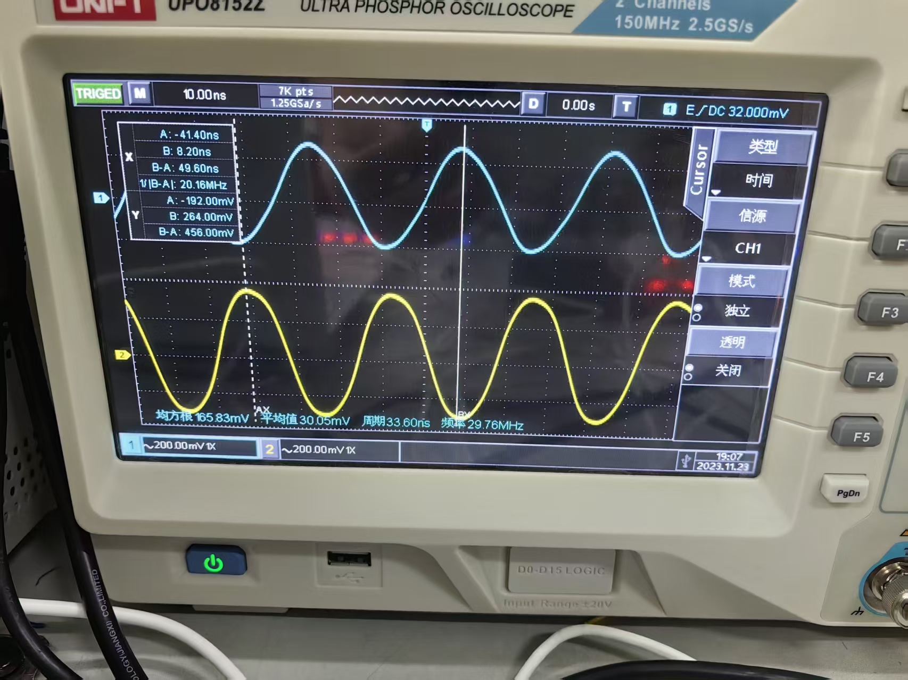
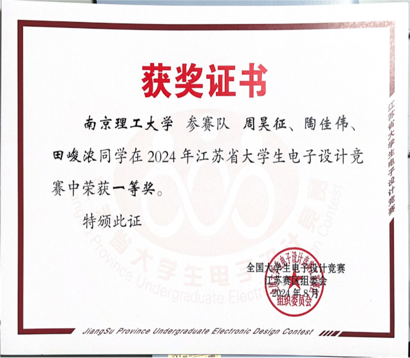
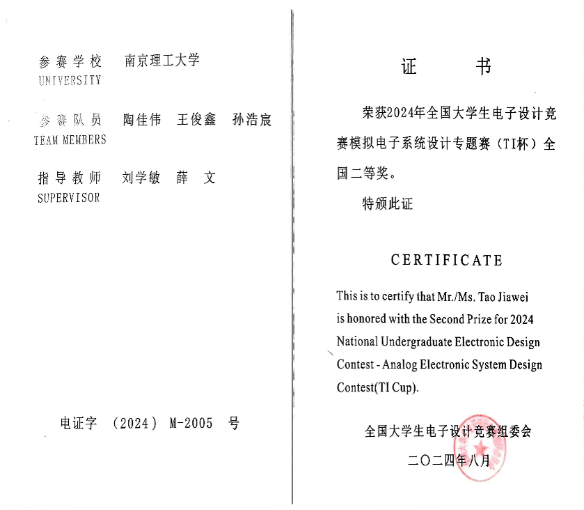

# diansai

这是 2024 年电子设计竞赛 C 题“无线通信传输系统”相关工程，获得省一等奖，并进入复测，所有指标均达到要求。

该项目采用 FPGA + STM32 + 串口屏的结构完成无线通信传输系统设计。对于刚入门 FPGA、希望结合 MCU 和显示交互做一个完整系统的小白来说，这是一个比较好的参考项目。

## 硬件平台

- FPGA：Xilinx XC7A100T-FGG484-2
- STM32：STM32F103VET6
- 串口屏：淘晶驰串口屏

## 工程内容

- FPGA 端逻辑工程
- STM32 端控制工程
- 串口屏交互相关内容
- 竞赛题目和项目资料
- 项目展示图片和获奖相关图片

## 项目图片

## 工程下载

完整工程已打包为 `diansai.rar`，请在本仓库的 [Release 页面](https://github.com/taojiawei-sarem/diansai/releases/tag/v1.0.0) 下载。

如果您觉得有用的话，请点一个 star。
